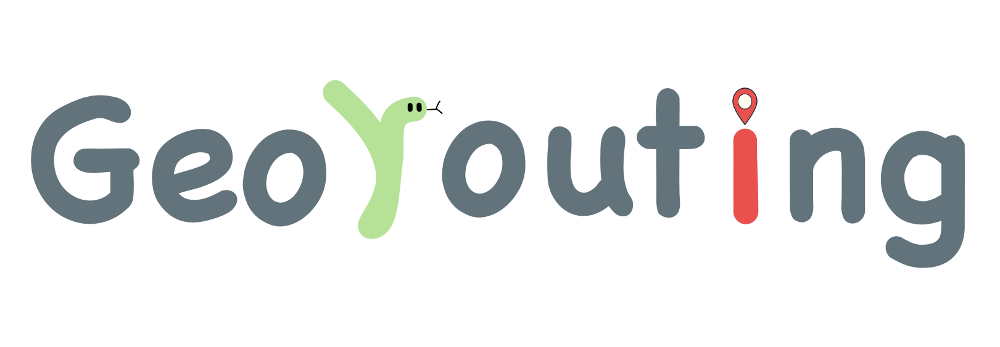

<!--  -->
<!--  -->
<!--  -->
<!--  -->

<!--  -->

**Geo routing for Python users**, supporting most of the routing tools, including OSRM, Google Maps, Bing Maps, etc. with a unified API. 

-   Free software: MIT license
-   Documentation: <https://wybert.github.io/georouting>
    

## Features

- Support most of the routing services, including Google Maps, Bing Maps, OSRM, etc.
- Provide a unified API for routing services
- Support calculating the travel distance matrix between multiple origins and destinations
- Support calculating the travel distance according to OD pairs.
- Easy to visualize the routing results
- Return the travel distance matrix in a Pandas `Dataframe` you like
- Return the routing results in a Geopandas `GeoDataFrame`
- Easy to extend to support more routing services

## Credits

This package was created with [Cookiecutter](https://github.com/cookiecutter/cookiecutter) and the [giswqs/pypackage](https://github.com/giswqs/pypackage) project template.
